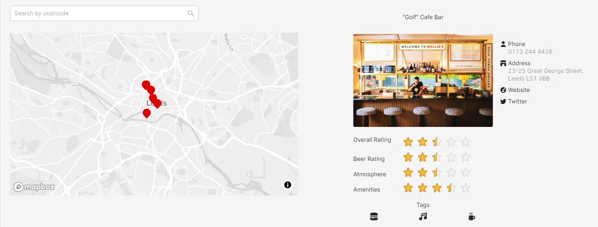

# Overview 

This project is to showcase how I designed and implemented the Leeds Beer Quest challenge and go into the technical aspects around the demo app. This includes how to run the project locally or if preferred how you can toggle the backend API to use an alternative backend repository. Firstly, we will touch upon the design approach and why a simplified structure was decided before going into details on the Backend API implementation and then finally how to run the application. 

## Web Design / UI

I've kept the UI wireframe simple, mimicking how google maps shows their reviews but also added all the extra relevant information to the side. This would be the display once you’ve clicked into the specific pub.  

Initially a clickable list view would be displayed ordered by distance to the post code entered. 

Backend
API Design

# Backend API Design

The Backend API uses the Mediator pattern and makes use of the [MediatR](https://github.com/jbogard/MediatR) library to help decouple the commands and queries following a CQRS pattern. 

At the moment, the InMemoryVenueRepository is using memory cache for speed but in the future we can store these results in Azure Table storage and use the decorator pattern to swap the new IVenueRepository in. By keeping the local InMemoryVenueRepository it will allow developers to run this locally for debugging purposes without the need for hosted infrastructure in Azure. 

# Running the application 

You can run the backend API by using the .Net CLI. First build the solution and then run the application.

`dotnet build`
`dotnet run`

# What is next?

1. Create the wire frame for what the list view would look like.
2. Add private setters and validation to the domain models to catch any invalid data 
3. Format the data returned to remove any unwanted escape characters 
4. Add Auto Mapper profiles to map the DTO to a domain model
5. Look at clean arcitecture and maybe have a application layer and move DataAccess to Infrastructure project 
6. We will need to work out the radius and implement helper methods to find all venues within a certain distance 

